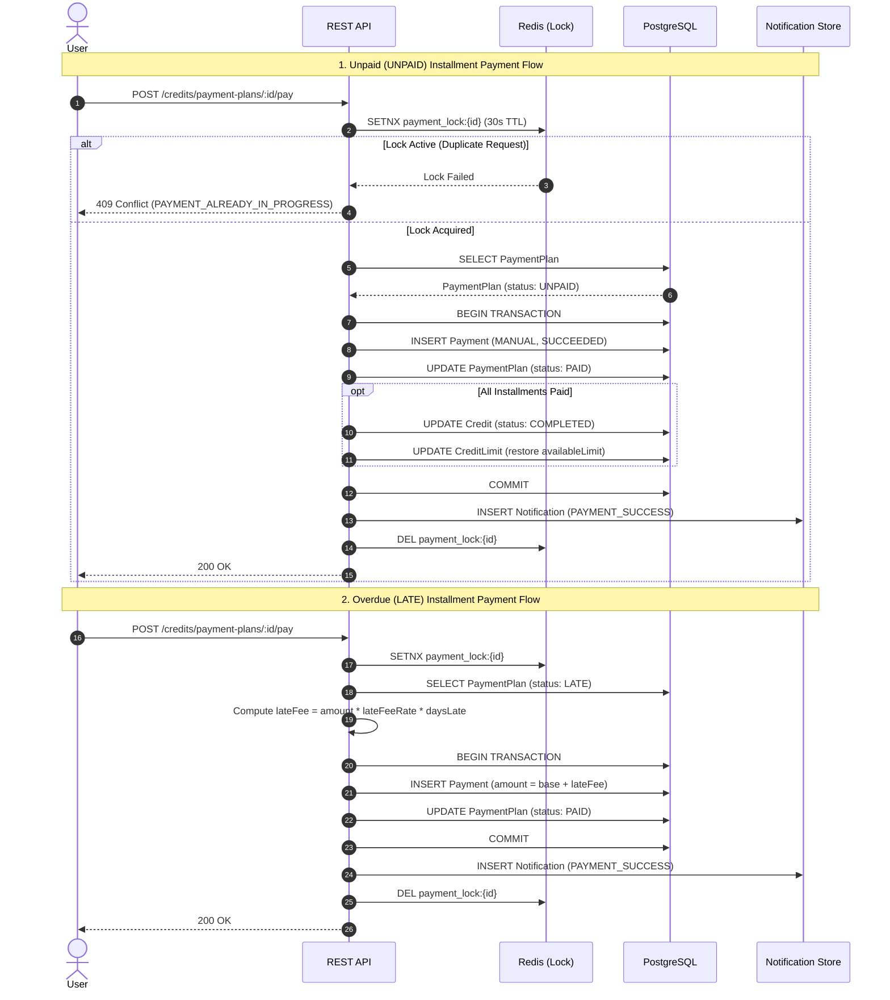

```mermaid
sequenceDiagram
    autonumber
    actor Client as User
    participant API as REST API
    participant Cache as Redis (Lock)
    participant DB as PostgreSQL
    participant Notif as Notification Store

    Note over Client, Notif: 1. Unpaid (UNPAID) Installment Payment Flow
    Client->>API: POST /credits/payment-plans/:id/pay
    API->>Cache: SETNX payment_lock:{id} (30s TTL)
    
    alt Lock Active (Duplicate Request)
        Cache-->>API: Lock Failed
        API-->>Client: 409 Conflict (PAYMENT_ALREADY_IN_PROGRESS)
    else Lock Acquired
        API->>DB: SELECT PaymentPlan
        DB-->>API: PaymentPlan (status: UNPAID)
        API->>DB: BEGIN TRANSACTION
        API->>DB: INSERT Payment (MANUAL, SUCCEEDED)
        API->>DB: UPDATE PaymentPlan (status: PAID)
        opt All Installments Paid
            API->>DB: UPDATE Credit (status: COMPLETED)
            API->>DB: UPDATE CreditLimit (restore availableLimit)
        end
        API->>DB: COMMIT
        API->>Notif: INSERT Notification (PAYMENT_SUCCESS)
        API->>Cache: DEL payment_lock:{id}
        API-->>Client: 200 OK
    end

    Note over Client, Notif: 2. Overdue (LATE) Installment Payment Flow
    Client->>API: POST /credits/payment-plans/:id/pay
    API->>Cache: SETNX payment_lock:{id}
    API->>DB: SELECT PaymentPlan (status: LATE)
    API->>API: Compute lateFee = amount * lateFeeRate * daysLate
    API->>DB: BEGIN TRANSACTION
    API->>DB: INSERT Payment (amount = base + lateFee)
    API->>DB: UPDATE PaymentPlan (status: PAID)
    API->>DB: COMMIT
    API->>Notif: INSERT Notification (PAYMENT_SUCCESS)
    API->>Cache: DEL payment_lock:{id}
    API-->>Client: 200 OK
```