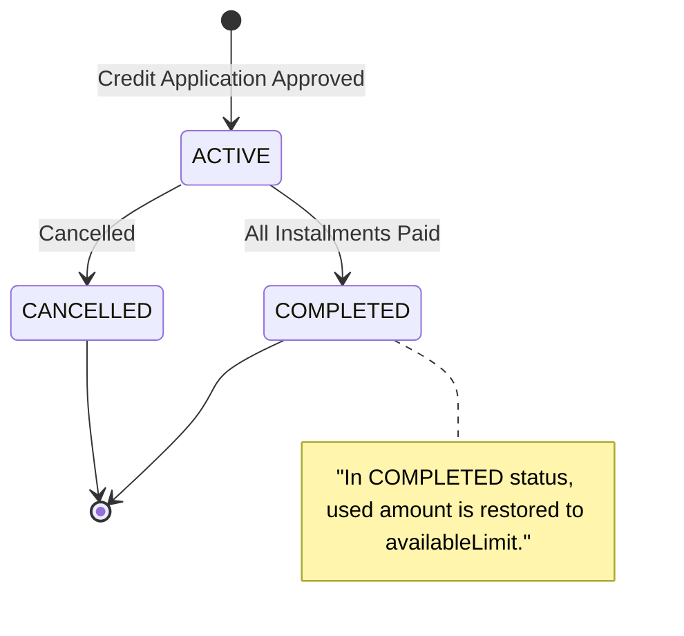
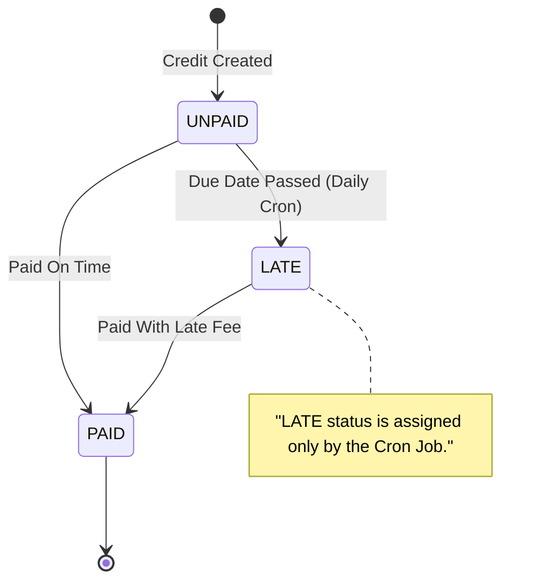

```mermaid
stateDiagram-v2
    [*] --> ACTIVE : Credit Application Approved
    
    ACTIVE --> COMPLETED : All Installments Paid
    ACTIVE --> CANCELLED : Cancelled
    
    COMPLETED --> [*]
    CANCELLED --> [*]

    note right of COMPLETED : "In COMPLETED status, used amount is restored to availableLimit."
```

```mermaid
stateDiagram-v2
    [*] --> UNPAID : Credit Created
    
    UNPAID --> PAID : Paid On Time
    UNPAID --> LATE : Due Date Passed (Daily Cron)
    LATE --> PAID : Paid With Late Fee
    
    PAID --> [*]

    note right of LATE : "LATE status is assigned only by the Cron Job."
```